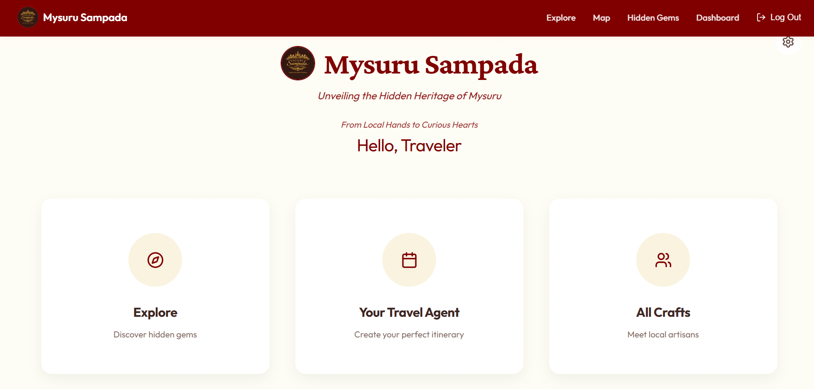
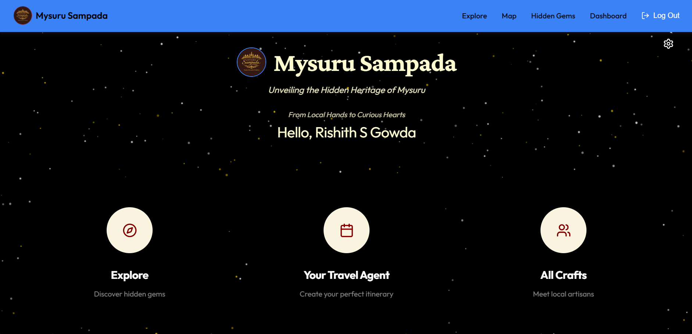
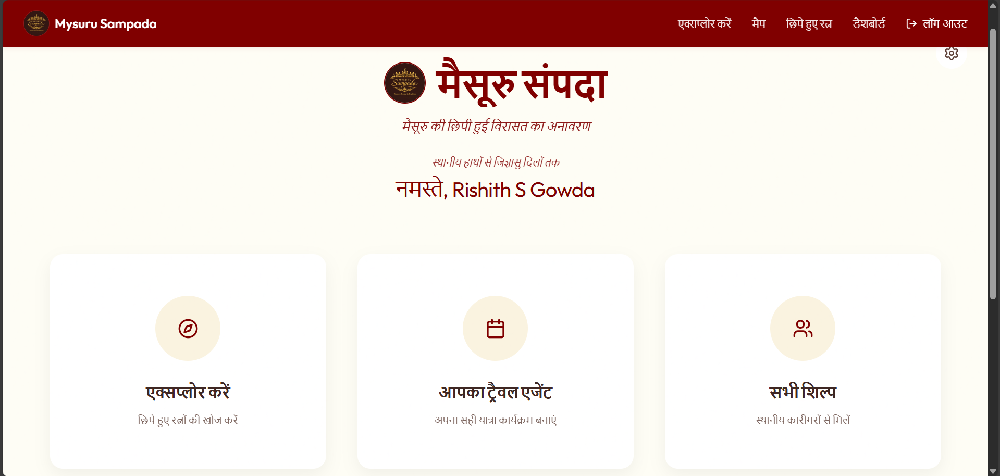
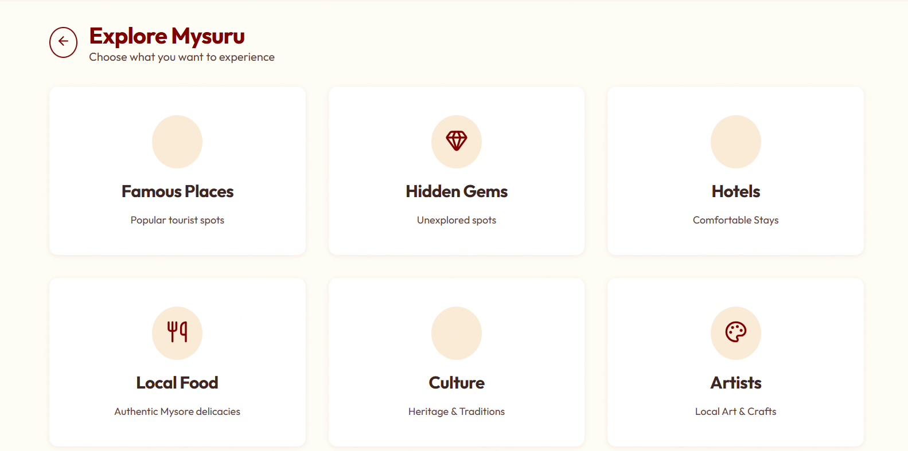
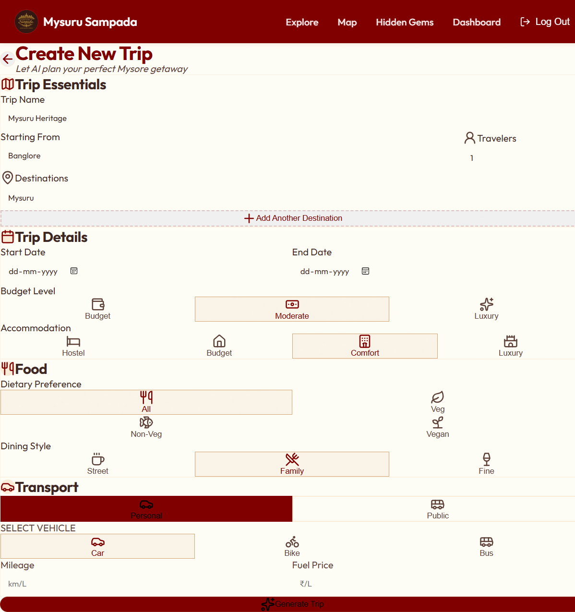
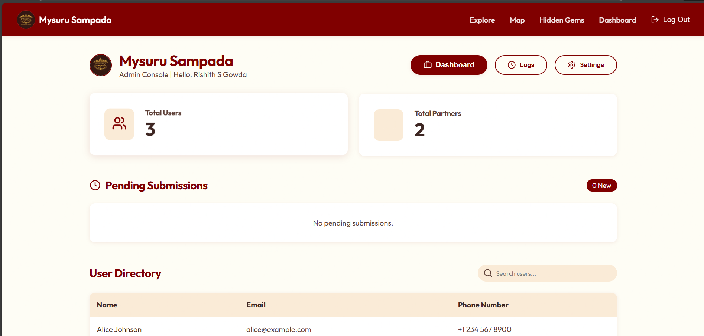

<p align="center">
  
</p>

# Mysuru Sampada – Multi-Language Tourism Platform

Mysuru Sampada is a modern, multi-language tourism web application designed to showcase Mysuru’s cultural heritage, hidden gems, and travel experiences through an interactive and feature-rich interface.

This project is built with a **full-stack vision**. The frontend is fully implemented and deployed, while backend services have been developed locally and are ready for integration.

🌐 **Live Demo:** https://mysurusampada.vercel.app

---


## 🌟 Project Highlights
- 🌍 Multi-language support (English, Hindi, Kannada)
- 🌗 Light Mode & Dark Mode
- 🧭 AI-assisted trip planning workflow
- 🧑‍💼 User, Partner, and Admin dashboards
- 🧠 Designed for backend scalability
- 🚀 Deployed on Vercel

---

## 🌐 Multi-Language Support (i18n)
- **3 Languages:** English, Hindi (हिंदी), Kannada (ಕನ್ನಡ)
- **160+ translation keys**
- Instant language switching
- Language preference stored using `localStorage`
- Full coverage of all user-facing text

---

## 📄 Pages & Functionality

### Core Pages
- **Home / User Dashboard** – Personalized landing with navigation shortcuts
- **Explore** – Famous places, hidden gems, food, culture, artists
- **Trip Planning** – AI-assisted itinerary builder
- **Maps** – Location-based exploration
- **Settings** – Theme toggle, language selection

### Dashboards
- **User Dashboard** – Trips overview and actions
- **Admin Dashboard** – User & partner management, statistics
- **Partner Dashboard** – Partner-specific management UI

> The repository demonstrates complete frontend flows designed to seamlessly connect with backend APIs.

---

## 🎨 UI & UX Features
- Light / Dark mode toggle
- Glass-morphism inspired components
- Particle background animation
- Custom glowing cursor
- Fully responsive layout

---

## 📸 Screenshots

### Home – Light Mode


### Home – Dark Mode


### Home – Hindi (i18n)


### Explore Section


### AI-Powered Trip Creation
A comprehensive trip planning workflow where users configure destinations, dates, budget, accommodation, food preferences, dining style, and transport options in a single guided interface.



### Admin Dashboard



---

## 📁 Project Structure
```
Mysuru Sampada/
├── src/
│ ├── components/
│ │ ├── Layout.jsx
│ │ ├── ParticleBackground.jsx
│ │ └── GlowingCursor.jsx
│ ├── context/
│ │ └── LanguageContext.jsx
│ ├── pages/
│ │ ├── Home.jsx
│ │ ├── Login.jsx
│ │ ├── Signup.jsx
│ │ ├── ForgotPassword.jsx
│ │ ├── Settings.jsx
│ │ ├── Explore.jsx
│ │ ├── TripPlanning.jsx
│ │ └── dashboards/
│ │ ├── UserDashboard.jsx
│ │ ├── AdminDashboard.jsx
│ │ └── PartnerDashboard.jsx
│ ├── data/
│ │ └── placesData.js
│ ├── App.jsx
│ ├── main.jsx
│ └── index.css
├── screenshots/
│ ├── home-light.png
│ ├── home-dark.png
│ ├── home-hindi.png
│ ├── explore.png
│ ├── create-trip.png
│ └── admin-dashboard.png
├── public/
├── index.html
├── package.json
├── vite.config.js
├── logo.jpeg
└── README.md
```

## 🔧 Technologies Used

### Frontend
- React (Hooks)
- React Router
- Vite
- Lucide React
- CSS Variables
- Canvas API

### Backend (Implemented Locally)
- Node.js
- REST API architecture
- PostgreSQL / Supabase
- Authentication & authorization logic

---

## 🧪 Current Setup
- Mock data used for UI flows and dashboards
- Backend logic implemented locally
- Ready for API integration into this repository

---

## 🛠 Backend Implementation (Planned Integration)
Backend responsibilities include:
- REST API development
- Database schema design
- User authentication & roles
- Trip, places, and booking logic
- Admin & partner management APIs

Backend code will be pushed to this repository in a future update.

---

## 📌 Project Status
🟢 **Completed (v1 – Frontend)**  
- Core features and UI fully implemented  
- Multi-language and theme support completed  
- Backend services ready for integration  

---

## 🎯 Future Enhancements
- Full backend API integration
- AI-driven itinerary recommendations
- Real-time bookings
- Payment gateway integration
- Mobile app (React Native)
- Additional Indian languages

---

## 📄 License
This project is built for educational and demonstration purposes.

---

**Built with ❤️ for Mysuru Tourism**
